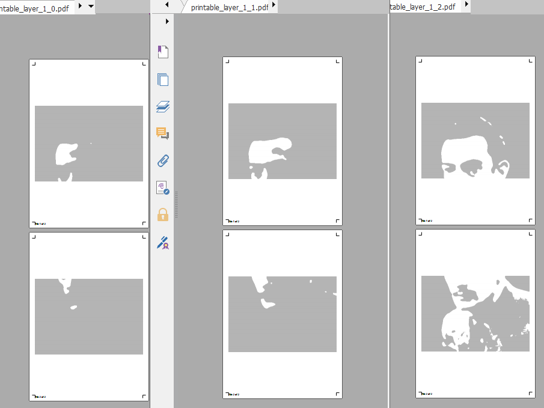
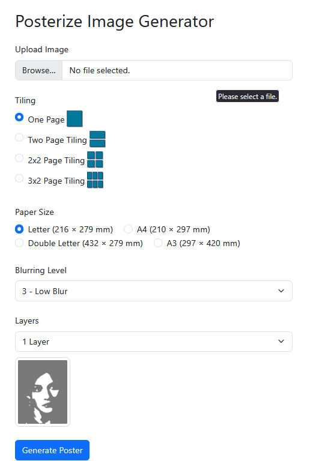

# Stencilize

Turn any photo into ready-to-print multi-layer stencil artwork — inspired by the bold, high-contrast style of street artists like Banksy.

Upload an image, choose how many stencil layers you want, pick your paper size, and Stencilize hands you back a set of PDFs: one per layer, ready to cut and spray. If you want a large-format poster, it can tile your image across multiple pages with alignment guides so you know exactly how to assemble them.



---

## Features

**Multi-layer stencil generation**
Stencilize breaks your image into tonal bands — each band becomes its own stencil layer. A 3-layer stencil, for example, gives you a shadow layer, a midtone layer, and a highlight layer. Stack them on your surface, spray each one in turn, and the layers combine into a complete image with depth and contrast.

**5 automatic variations**
Every run produces five slightly different interpretations of your image. The threshold boundaries between tonal bands are randomised slightly each time, so you can pick the variation whose balance of light and shadow looks best before you commit to cutting.

**Print-ready PDFs with tiling**
Each layer is exported as a PDF sized to your chosen paper format. If you want a large poster, the tiling option splits the image across multiple pages — 1, 2, 4, or 6 sheets — so you can print on a standard home or office printer and assemble the pieces into something much bigger. Every tiled page includes cut marks at the corners to make trimming and alignment straightforward.

**Blurring control**
A blur slider lets you control how much detail is preserved before posterization. Low blur keeps fine edges sharp — good for detailed subjects. Higher blur simplifies the image first, producing cleaner, chunkier stencil shapes that are easier to cut by hand.

**Poster assembly guide**
When tiling is enabled, each page is labelled (e.g. "Tile 2 of 4") and printed with corner cut marks. Trim along the marks, lay the pages out in order, and tape them together — the cut marks give you a consistent margin so the seams line up.

---

## Usage

**Requirements**

```
Flask
opencv-python
numpy
Pillow
reportlab
werkzeug
```

Install with:

```bash
pip install flask opencv-python numpy pillow reportlab werkzeug
```

**Running the app**

```bash
python posterize_app.py
```

Then open `http://localhost:5000` in your browser.



**Step-by-step**

1. **Upload your image** — JPEG or PNG. High-contrast photos with a clear subject work best.
2. **Choose a tiling layout:**
   - *One Page* — the whole image fits on a single sheet.
   - *Two Page* — splits the image across 2 sheets (stacked vertically).
   - *2×2 Page* — splits across 4 sheets in a grid.
   - *3×2 Page* — splits across 6 sheets in a grid, good for large murals.
3. **Choose a paper size:** Letter, A4, Double Letter, or A3.
4. **Set the blur level:** 1 (no blur / sharp detail) up to 7 (heavy blur / simplified shapes). Start at 3 for most images.
5. **Set the number of layers:** 1 to 5. More layers = more tonal range and more stencils to cut.
6. Click **Generate Poster**.

The output is a folder of PDFs — one per layer per variation — organized under `posterized_variations/`. Print each layer's PDF, cut the dark areas out of the page (or a sheet of acetate/card stock laid over it), and you have your stencils.

**Tips for good results**

- Images with a clear subject against a simple background posterize most cleanly.
- Start with 3 layers and adjust from there — 5 layers is more nuanced but more work to cut.
- If the stencil shapes look too noisy or fragile, increase the blur level.
- Compare the 5 output variations before printing — sometimes variation 2 or 3 has better tonal balance than variation 1.

---

## Architecture

### Image processing pipeline

The core pipeline lives in `functions/posterize_funcs.py` and runs in four stages:

**1. Auto-levels**

Before anything else, the image is contrast-normalised using a histogram-based auto-levels pass (`auto_levels`). This clips the darkest and lightest 0.5% of pixels and stretches the remaining tonal range to fill 0–255. It compensates for underexposed or washed-out source photos so the posterization always has a full tonal range to work with. It can operate per-channel (to correct colour casts) or on a combined luminance histogram.

**2. Grayscale conversion and Gaussian blur**

Stencils are monochrome, so the image is converted to grayscale with OpenCV's `cvtColor`. A Gaussian blur is then applied with a kernel size controlled by the user's blur setting (kernel sizes 1, 3, 5, or 7). The Gaussian blur acts as a low-pass filter — it suppresses high-frequency noise and fine texture before the tonal quantisation step, which prevents the posterized output from having hundreds of tiny disconnected islands that would be impossible to cut.

**3. Threshold-based posterization with randomised variations**

The core posterization step (`posterize`) works by dividing the 0–255 grayscale range into evenly spaced bands using `numpy.linspace`, then assigning each pixel to the band it falls into. The number of bands is the number of layers the user selected.

To generate the 5 variations, small Gaussian noise (σ = 5 intensity units) is added to the threshold positions independently for each variation. This shifts the boundary between tonal bands slightly, changing which pixels fall into which layer. Some variations will preserve more shadow detail; others will push more of the midtones into the highlight layer. After thresholding, a **median blur** (9×9 kernel) is applied to remove salt-and-pepper noise and smooth the edges between regions. The median filter is well-suited here because it preserves hard edges (important for stencil shapes) while eliminating isolated outlier pixels.

**4. Binary layer extraction**

Each posterized variation contains a handful of discrete brightness levels — one per stencil layer. The `generate_binary_layers` function identifies these unique brightness values and generates a separate binary mask for each. In each mask, pixels at or above that brightness level are set to white (255) and pixels below are set to light grey (180). The light grey acts as a semi-transparent base so you can see the layer's shape in context. The top brightness level (pure white) is skipped — it represents the bare surface and doesn't need a stencil.

### PDF generation and tiling

The `generate_tiled_pdf` function uses **ReportLab** to produce the printable PDFs. For a tiled layout, it calculates a grid of rows and columns (1×1, 2×1, 2×2, or 3×2), crops the corresponding region of the layer image for each cell, and renders it centred on its page with a configurable margin. Aspect ratio is preserved — the image is scaled to fill the available area without stretching.

Each page also receives **cut marks** drawn at all four corners (`draw_cut_marks`). These are short lines in the margin that indicate exactly where to trim. When you align two trimmed pages, the cut marks land flush against each other and the image continues seamlessly across the seam.

### Web layer

`posterize_app.py` is a minimal Flask application. It handles file upload (PNG and JPEG only, validated by extension), passes the user's form parameters to `posterize_main`, and serves the results. Uploaded files are saved to an `uploads/` directory and outputs to `posterized_variations/`.

---

## Output structure

```
posterized_variations/
└── variation_1/
│   ├── posterized_version_1.png        ← full grayscale preview
│   ├── layer_1_0.png                   ← binary mask, layer 0
│   ├── printable_layer_1_0.pdf         ← print-ready PDF for layer 0
│   ├── layer_1_1.png
│   ├── printable_layer_1_1.pdf
│   └── ...
├── variation_2/
│   └── ...
└── ...
```

Each variation folder contains one PDF per stencil layer. Print them in order (darkest layer first is conventional), cut the stencils, and build up the image layer by layer.

---

## Supported paper sizes

| Name          | Dimensions         | Good for                        |
|---------------|--------------------|---------------------------------|
| Letter        | 216 × 279 mm       | North American standard printers|
| A4            | 210 × 297 mm       | International standard printers |
| Double Letter | 432 × 279 mm       | Wide-format printers            |
| A3            | 297 × 420 mm       | Large-format / design printers  |
